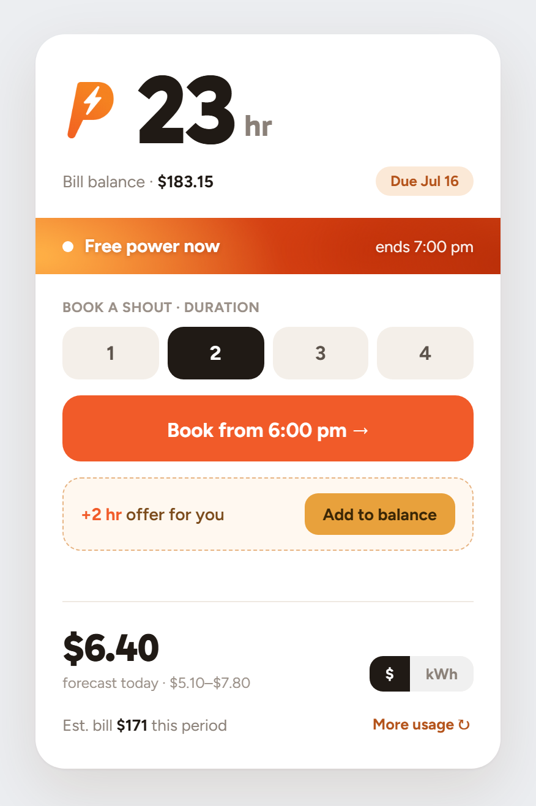
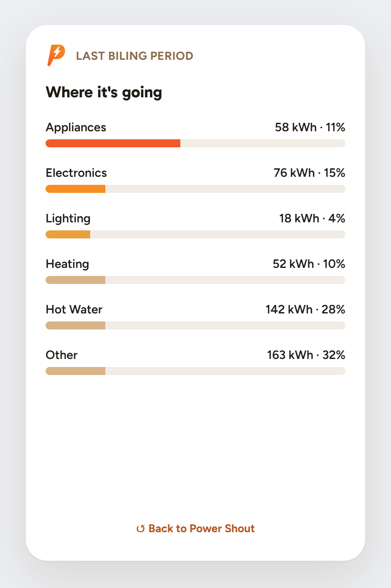

<div align="center">

# Genesis Energy for Home Assistant

**Your Genesis Energy (NZ) electricity, gas and Power Shout data, living where the rest of your home already does.**

[](https://hacs.xyz/)
[](https://github.com/letitbe-dull/genesisenergy/releases)
[](https://github.com/letitbe-dull/genesisenergy/stargazers)
[](https://github.com/letitbe-dull/genesisenergy/issues)
[](https://github.com/letitbe-dull/genesisenergy/commits)
[](https://buymeacoffee.com/letitbedull)

[Install](#installation) · [Configure](#configuration) · [Power Shout Card](#the-power-shout-card) · [Energy Dashboard](#using-with-the-energy-dashboard) · [Services](#services) · [Report a Bug](https://github.com/letitbe-dull/genesisenergy/issues/new)

</div>

---

## Why this exists

Genesis Energy's web portal sits on a quiet pile of good data - hourly consumption, costs, forecasts, Power Shout balances - and none of it ever leaves the portal. This integration goes and fetches it, so you can chart your usage, feed the Energy Dashboard, and build automations around Power Shouts and the greener hours of the grid.

> [!NOTE]
> This integration is built by **reverse-engineering the Genesis Energy web portal** and is **not officially supported by Genesis**. If they redecorate their website or change an API, this may quietly stop working.

## Features

| | |
|---|---|
| **Energy Dashboard** | Long-term statistics for **Electricity** and **Gas** consumption (kWh), plus daily **Cost** (NZD). |
| **LPG (Bottled Gas)** | Spots LPG accounts on its own and surfaces order status, the full delivery history and usage stats. |
| **Electricity Forecasts** | Today's forecast usage and cost sensors, with a high/low range and the whole 7-day forecast tucked into attributes. |
| **Usage Breakdown** | How Genesis reckons you're spending it - Appliances, Electronics, Lighting and Other (kWh). |
| **Grid Generation** | `Eco-Friendly (%)` for the current hour, with a two-day hourly generation-mix forecast so you can shift the heavy loads to the clean hours. |
| **EV Plan Sensors** | Day (Peak) and Night (Off-Peak) usage and cost, plus a Savings sensor showing what the EV plan buys you over the standard rate. |
| **Power Shout** | Eligibility and balance (hours), upcoming bookings, active offers, plus *Booking In Progress* and *Booking Upcoming* binary sensors. |
| **Power Shout Card** ✨ | A purpose-built Lovelace card - book shouts, accept offers and watch your usage without leaving the dashboard. [See below](#the-power-shout-card). |
| **Billing Cycle** | Electricity, Gas and Total used, estimated total bill and estimated future use ($). |
| **Account Details** | One sensor doing the work of a filing cabinet - billing plans, account IDs and the raw dashboard data, all in its attributes. |
| **Services** | Book and accept Power Shouts, backfill historical statistics, and force an immediate refresh when you can't wait the hour. |

## The Power Shout Card

A dedicated Lovelace card that turns your Power Shout balance into something you can actually *use*, not just read. It pulls together the balance, bookings, offers and forecast that would otherwise be scattered across a dozen sensors, and puts a **Book** button front and centre.

<div align="center">

&nbsp;&nbsp;


<sub><em>Front: balance, live bar, booking and forecast. Back (tap <strong>More usage ↻</strong>): where your power's going.</em></sub>

</div>

### What it does

- **Balance as currency** - your Power Shout hours shown as a balance you *spend*, with your bill balance and due date alongside.
- **Live "Free power now" bar** - lights up with an animated glow while a shout is actually running, and tells you when it ends.
- **Book in two taps** - pick a duration (1-4 hrs) and a start time, hit the button. It calls [`add_powershout_booking`](#genesisenergyadd_powershout_booking) for you.
- **One-tap offers** - when Genesis has an offer going, an *Add to balance* row appears. Accepting is a deliberate tap, never silent.
- **Today's forecast** - forecast cost with a low/high band, and a **$ ⇄ kWh** toggle. Plus your estimated bill for the period.
- **Flip for usage** - the back face breaks down where your power's going (Appliances, Electronics, Lighting, Heating, Hot water, Other) and shows your EV plan savings if you're on one.
- **Light/dark aware** with a mobile fallback (flip is disabled and the back face hidden under ~440px wide).

### Adding it to a dashboard

The card ships **inside the integration** and registers itself as a Lovelace resource automatically - there's nothing to download and no resource URL to paste in.

1. Make sure the integration is installed and configured (see below).
2. Edit any dashboard → **+ ADD CARD** → search for **Genesis Energy — Power Shout**, or add it by YAML:

   ```yaml
   type: custom:genesisenergy-powershout-card
   ```

That's it. The card **auto-discovers** your Power Shout entities, so for a single Genesis account no further config is needed.

<details>
<summary><strong>Multiple accounts? Point the card at a specific one</strong></summary>

The card finds your entities from the `_power_shout_balance` sensor. If you have more than one Genesis account, name the balance sensor for the account you want and the card derives the rest:

```yaml
type: custom:genesisenergy-powershout-card
entity_balance: sensor.genesis_energy_2_power_shout_balance
```

Any individual entity can also be overridden with its own key (e.g. `entity_forecast_cost`, `entity_ev_savings`) if your setup is unusual.

</details>

> [!NOTE]
> If the card doesn't appear after installing, do a hard refresh of your browser (**Ctrl+F5**) to clear the cached Lovelace resources. If HA runs in YAML dashboard mode, the auto-registration is skipped - add `/genesisenergy/powershout-card.js` as a **module** resource manually under **Settings → Dashboards → ⋮ → Resources**.

## Installation

### HACS (recommended)

1. [Install HACS](https://www.hacs.xyz/docs/use/download/download/) if you haven't already.
2. Add this repository, or click the button below:

   [](https://my.home-assistant.io/redirect/hacs_repository/?owner=letitbe-dull&repository=genesisenergy&category=integration)
3. Install the **Genesis Energy** integration.
4. Restart Home Assistant.

### Manual

1. Copy the `genesisenergy` folder from this repo into your Home Assistant `custom_components` folder
   (path: `<config_dir>/custom_components/genesisenergy/`).
2. Restart Home Assistant.

## Configuration

1. Go to **Settings → Devices & Services**.
2. Click **+ ADD INTEGRATION** and search for **Genesis Energy**.
3. Enter your Genesis Energy **Email** and **Password** - the same ones you use for the [Genesis Energy IQ Account portal](https://myaccount.genesisenergy.co.nz/). Nothing new to remember.
4. Click **SUBMIT**. The integration quietly sets up a device and all its sensors.

### Re-authentication

If your login stops working - usually after a password change - Home Assistant flags the integration and asks you to **re-enter your password** through the standard reauth dialog. No deleting, no re-adding, no starting over. Login tokens are kept on disk, so a restart picks up the saved session instead of logging in from scratch every time.

### Options

Click **CONFIGURE** to open **Data Synchronisation Settings**:

- **Enable Daily Auto-Correction** *(default: off)* - Genesis data tends to run 24–48 hours behind, and what it shows early is often an estimate it later revises. Switch this on and, once a day after **1:00 PM**, the integration re-downloads and **overwrites** the last few days of statistics to fill the gaps and correct those temporary guesses. Worth turning on if your Energy Dashboard looks patchy or keeps changing its mind.

## Using with the Energy Dashboard

This integration creates long-term statistics you can wire straight into the Energy Dashboard.

> [!IMPORTANT]
> The integration imports **nothing** on first startup. That's on purpose - it gives you the chance to run a proper historical backfill before anything lands. To get the first numbers in, call either [`genesisenergy.force_update`](#genesisenergyforce_update) or [`genesisenergy.backfill_statistics`](#genesisenergybackfill_statistics).

To set up the dashboard:

1. Go to **Settings → Dashboards → Energy**.
2. Under **Electricity grid**, click **ADD CONSUMPTION** and pick `Genesis Electricity Consumption Daily`.
3. Under **Gas consumption**, click **ADD GAS SOURCE** and pick `Genesis Gas Consumption Daily`.

The underlying statistic IDs are **external statistics** - they aren't entities, so they have no `sensor.` state and won't show up where you'd expect. You'll find them only in the Energy Dashboard and under **Developer Tools → Statistics**:

- `genesisenergy:electricity_consumption_daily`
- `genesisenergy:electricity_cost_daily`
- `genesisenergy:gas_consumption_daily`
- `genesisenergy:gas_cost_daily`

## Services

### `genesisenergy.backfill_statistics`

Pulls in historical usage data. Most rewarding on a fresh install, where it builds you a deep history from nothing.

| Field | Description | Example |
|---|---|---|
| `days_to_fetch` | **Required.** Past days of data to retrieve (1–730). | `365` |
| `fuel_type` | **Required.** `electricity`, `gas`, or `both`. | `electricity` |
| `force_overwrite` | **Required.** `false` only fills missing days; `true` re-fetches and **overwrites** the whole period. | `false` |

<details>
<summary><strong>How it works (worth a read)</strong></summary>

By default (`force_overwrite: false`) the service is **non-destructive** - it only adds data where **none currently exists**. It won't tread on what you've already got.

- **Clean install:** the database is empty, so run with a big number (say `365`) to pull in a full year.
- **After data exists:** with `force_overwrite: false` it fetches what you asked for but only imports the days you're missing, leaving the rest alone.
- **Fixing bad data:** set `force_overwrite: true` to re-download and overwrite the requested period - your repair tool for gaps or those corrupted, estimated days. (You can also nudge individual points by hand in **Developer Tools → Statistics**.)

</details>

### `genesisenergy.accept_powershout_offer`

Accepts a pending Power Shout offer.

<details>
<summary><strong>Example: auto-accept every offer from your dashboard</strong></summary>

**1. Create the script** - go to **Settings → Automations & Scenes → Scripts**, add a new script, switch to YAML mode and paste:

```yaml
alias: Accept All Power Shout Offers
sequence:
  - condition: template
    value_template: >-
      {{ state_attr('sensor.genesis_energy_power_shout_balance',
      'active_offers_count') > 0 }}
  - repeat:
      for_each: >-
        {{ state_attr('sensor.genesis_energy_power_shout_balance',
        'active_offers') }}
      sequence:
        - service: genesisenergy.accept_powershout_offer
          data:
            offer_id: "{{ repeat.item.loyaltyOffer.guid }}"
        - delay:
            seconds: 2
icon: mdi:auto-fix
description: "Accepts all available Power Shout offers from Genesis Energy."
```

**2. Add a conditional button** to your dashboard - it only shows its face when there are offers going:

```yaml
type: conditional
conditions:
  - entity: binary_sensor.genesis_energy_power_shout_offers_available
    state: "on"
card:
  type: button
  name: Accept Power Shout Offer(s)
  icon: mdi:auto-fix
  tap_action:
    action: call-service
    service: script.accept_all_power_shout_offers
grid_options:
  columns: 6
  rows: 2
```

</details>

### `genesisenergy.add_powershout_booking`

Books a Power Shout from your automations or scripts.

| Field | Description | Example |
|---|---|---|
| `start_datetime` | **Required.** Start date/time in your local timezone. | `"2025-07-20 19:00:00"` |
| `duration_hours` | **Required.** Duration in hours (e.g. 1, 2, 3). | `2` |

### `genesisenergy.force_update`

Triggers an immediate data refresh, for when you'd rather not wait out the hour.

| Field | Description | Example |
|---|---|---|
| `fuel_type` | **Required.** `electricity`, `gas`, or `both` (`both` for the full sweep). | `both` |

## First-time setup for new installs

On first install the integration grabs the last 4 days of usage but **holds off importing** any of it into long-term statistics - leaving the door open for you to backfill some real history first.

**The first import is yours to trigger:**

1. Once it's installed and configured, give it a minute to settle in.
2. **Want deep history?** Call `genesisenergy.backfill_statistics` with `fuel_type: both` and `days_to_fetch` set to taste (e.g. `365` for a year). This becomes the bedrock of your database - a full history from day one.
3. **Only want recent data?** Call `genesisenergy.force_update` to bring in the last 4 days and stand up your initial statistics.

Run either one once and the integration takes it from there, refreshing on its own every hour.

## Debugging

When something's misbehaving and you want to see why, turn on debug logging by adding this to `configuration.yaml`:

```yaml
logger:
  default: info
  logs:
    custom_components.genesisenergy: debug
```

## Contributing

Issues and pull requests are genuinely welcome - open one [here](https://github.com/letitbe-dull/genesisenergy/issues). Even a tidy bug report helps.

If this saved you an afternoon of squinting at the portal, you can [buy me a coffee](https://buymeacoffee.com/letitbedull).

---

<div align="center">
<sub>Not affiliated with or endorsed by Genesis Energy Limited. Use at your own risk.</sub>
</div>
